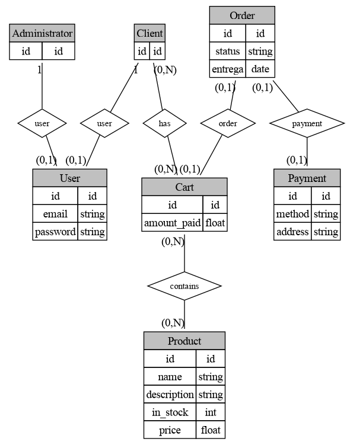

# DiaLang
Not to be confused with the actual sofware, Dia, which this isn't related to.

Mini language to generate Brazilian-Styled DER (Diagrama Entidade Relacionamento) by way of Graphviz.

Usage: `dialang <input file>`

Will print to stdout (and stderr) the generated graphviz DOT.

Using the following incantation you can generate a .png file:

```dialang input.txt | dot -Tpng out.png```

Example:


```
User {
    id id
    string email
    string password
}

Administrator {
    id id
}

Client {
    id id
}

Administrator 1--1 User: user
Client 1--1 User: user

Product {
    id id
    string name
    string description
    int in_stock
    float price
}

Cart {
    id id
    float amount_paid
}

Cart n--n Product: contains
Client n--n Cart: has
Order 1?--1 Cart: order

Payment {
    id id
    string method
    string address
}

Order {
    id id
    string status
    date entrega
}
Order 1?--1 Payment: payment
  
```

