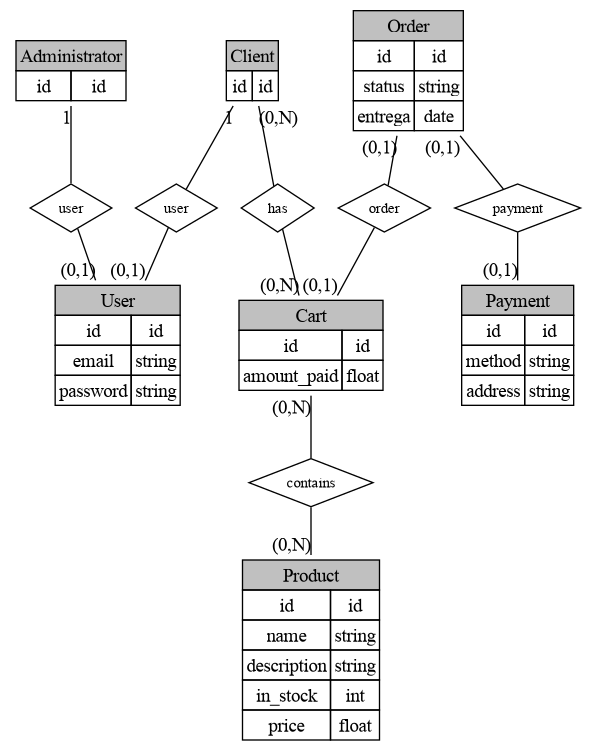
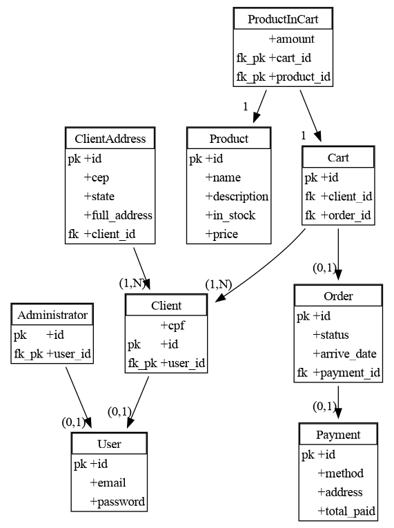

# DiaLang
Not to be confused with the actual sofware, Dia, which this isn't related to.

Mini language to generate Brazilian-Styled DER (Diagrama Entidade Relacionamento) by way of Graphviz.

Also supports the relational "real" database diagram thingy.

Usage: `dialang [-m <der|orm>] <input file>`

Will print to stdout (and to `out.dot`) the generated graphviz DOT.

Using the following incantation you can generate a .png file:

```dialang input.txt | dot -Tpng der.png```


## DER
Example:


```
User {
    id id
    string email
    string password
}

Administrator {
    id id
}

Client {
    id id
}

Administrator 1--1 User: user
Client 1--1 User: user

Product {
    id id
    string name
    string description
    int in_stock
    float price
}

Cart {
    id id
    float amount_paid
}

Cart n--n Product: contains
Client n--n Cart: has
Order 1?--1 Cart: order

Payment {
    id id
    string method
    string address
}

Order {
    id id
    string status
    date entrega
}
Order 1?--1 Payment: payment
  
```

# Relational (ORM or MOR)

```
User {
    id id
    string email
    string password
}

ClientAddress {
    id id
    string cep
    string state
    string full_address
}


Administrator {
    id id
}

Client {
    string cpf
    id id
}

Product {
    id id
    string name
    string description
    int in_stock
    float price
}

Cart {
    id id
}

Payment {
    id id
    string method
    string address
    float total_paid
}

Order {
    id id
    string status
    date arrive_date
}

ProductInCart {
    int amount
}

# M-N Cart product auxiliary table
# Links using '=' instead of '-' means it's an fk_pk
ProductInCart 1==1 Cart
ProductInCart 1==1 Product

Cart 1--n Client
Cart 1--1? Order
Order 1--1? Payment
ClientAddress 1--n Client

# User Rules
# Conjunctions/Disjunctions not supported yet but trivial to add
Administrator 1==1? User
Client 1==1? User
```
